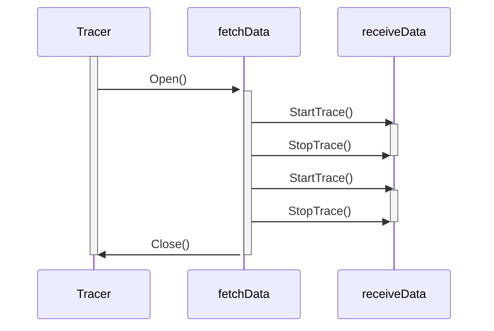

canlink
======================

`canlink` contains utilities for managing CAN traffic for the duration of a HIL test. Currently supported is a CAN Tracer object to capture traffic during a test.

CAN Tracer
---------------

The CAN Tracer captures all traffic on a CAN bus 
during a test and dumps it into a file.

### Usage

1) Create an instance of Tracer with the `NewTracer()` function. 
A can interface, directory and logger must be provided as arguments. 
Functional options are available of type `TracerOption` if required. 

    ```go
    func main() {
        writers := make([]writer.WriterIface, 0)
        jsonWriter := writer.NewWriter(
            logger,
            ".jsonl",
        )
        asciiWriter := writer.NewWriter(
            logger,
            ".asc",
        )
        writers = append(writers, jsonWriter)
        writers = append(writers, asciiWriter)

        tracer := canlink.NewTracer(
            "can0",
            "/opt/traces",
            logger,
            connection,
            canlink.WithBusName("PT"),
            canlink.WithTimeout(5*time.Minute))
            canlink.WithWriters(writers)
    }
    ```
2) Open the Tracer using _Open()_

    ```go
    func main() {
        err = tracer.Open(ctx)
    }
    ```
3) To start the tracer and start recording traffic, call _StartTrace()_

    ```go
    func main() {
        err = tracer.StartTrace(ctx)
    }
    ```
4) To stop the Tracer and stop recording traffic, call _StopTrace()_. The Tracer will then dump the cached traffic in standard format to the filepath specified in Step 1.

    __NOTE: If the timeout duration has exceeded what was specific in Step 1, the Tracer will have called _StopTrace()_ on its own, and any further stop calls will be ignored.__

    ```go
    func main() {
        err = tracer.StopTrace()
    }
    ```
5) The Tracer object is reusable. If a new CAN Trace is desired, the Tracer can be started and stopped again as in Steps 3-4. A new file will be written to with this traffic.

6) When tracing is no longer required, the Tracer should be closed using _Close()_

    ```go
    func main() {
        err = tracer.Close()
    }
    ```

 ### High-Level Overview

